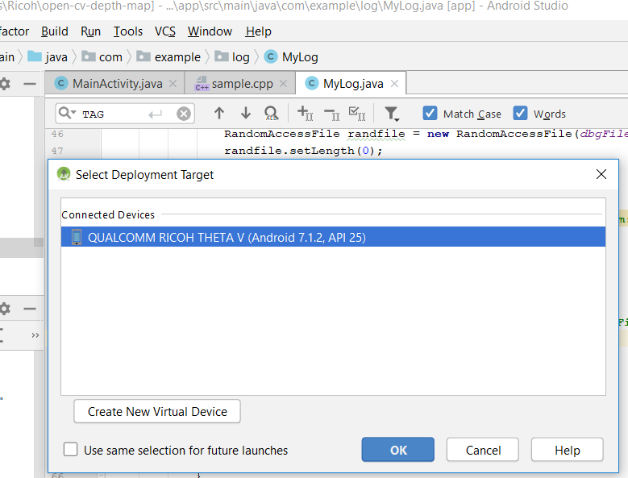
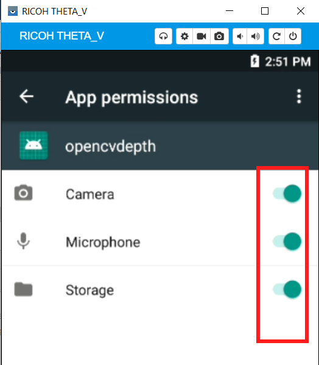
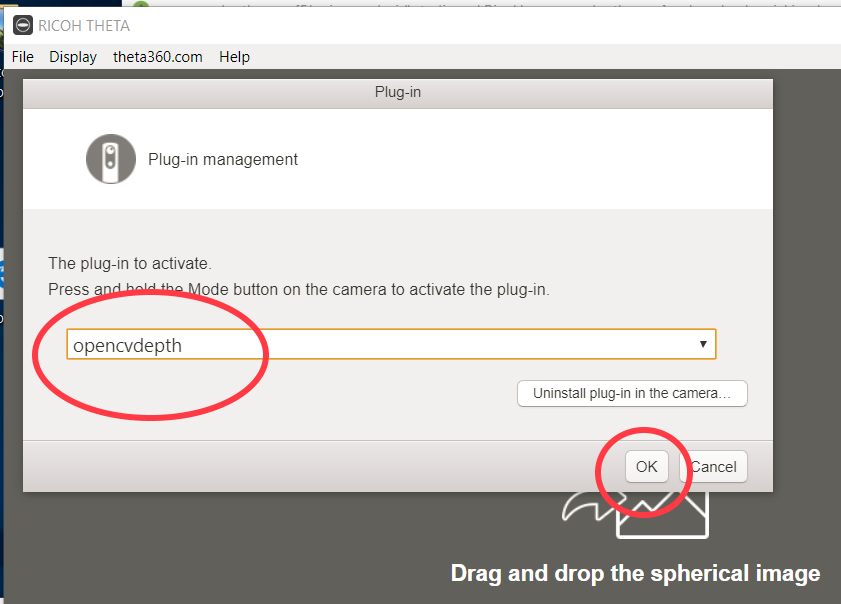
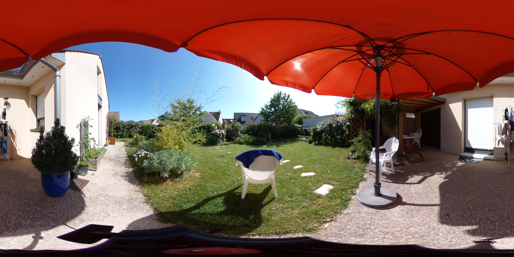
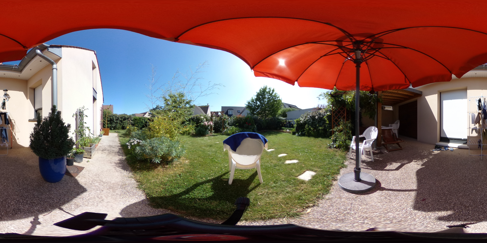
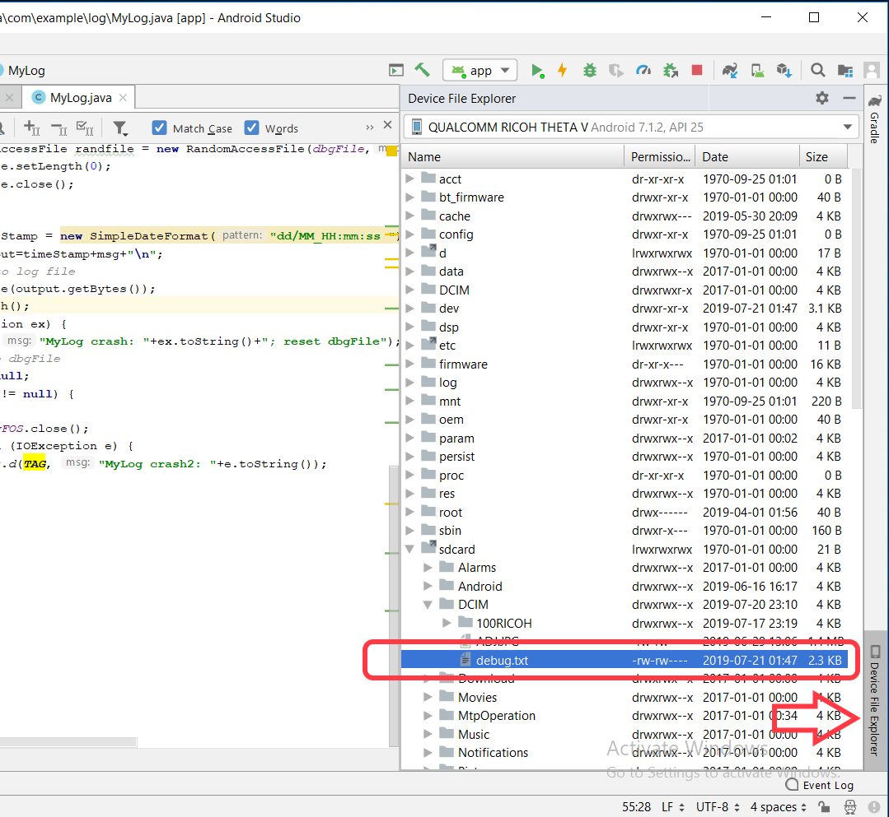
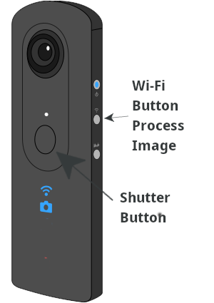

# What this program is about

The purpose of the project is to add depth information on Ricoh Theta V 360 deg images so they become 3D images, in order to extend their applications to 3D image applications and to virtual reality applications. The depth information is extracted from a pair of stereo images. This project is implemented in the form of a plugin on Theta V camera, a plugin being a secondary application on the camera that user can run by temporarily stepping away from the camera's main (shooting) function. It offers an convenient way to shoot the scenes and start depth-map calculation all by the same plugin.

## Important Note on App Permissions

You must enable storage permissions in the settings.
If you have using a physical device RICOH THETA, you can
use Vysor to go into Settings and enable storage permissions.

# How to operate this plugin

1) With the opencvdepth project opened in Android Studio: 
   - Run > Run 'app', 
   - select QUALCOMM RICOH THETA V as hardware target, then click OK.
This will install the plugin .apk package to ThetaV cam and run it there.

2) The plugin requires android permission on device storage access.
If storage permission is missing, Android Studio logcat would show:
	 D/THETADEBUG: WARNING: You Need to enable storage permission
	 D/THETADEBUG: MyLog new dbgFile : /storage/emulated/0/DCIM/debug.txt
	 D/THETADEBUG: MyLog crash: java.io.FileNotFoundException: /storage/emulated/0/DCIM/debug.txt (Permission denied); reset dbgFile
In that case, use Vysor to toggle the permissions on in camera's Android Settings>Apps>opencvdepth>App permision.

If storage permission is correctly granted, Android Studio logcat would show:
	D/THETADEBUG: storage permission is granted
	D/THETADEBUG: MyLog new dbgFile : /storage/emulated/0/DCIM/debug.txt

3) for end-user to use the plugin and to give the control over the camera's button to the plugin, the plugin must be selected using windows (or phone) application "RICOH THETA":

4) To run the plugin opencvdepth after it has been installed
   - turn on the camera if it is sleeping
   - Short-press camera's side "Mode" button untill the still camera is selected, if not already selected by default.
   This step is important because if video camera is selected before entering the plugin, the plugin would not work.
   
5) long-press camera's side "Mode" button untill the indicator changes from blue to white.
   The white LED indicates that the plugin is selected and is running and is the one reponding to buttons.
   Android Studio logcat will show:
		D/THETADEBUG: storage permission is granted
		D/THETADEBUG: set key callback
		D/THETADEBUG: onResume Ap is NOT Connected 
		D/THETADEBUG: OpenCV version is: 3.4.5
		
6) Take a pair of stereo-images with ThetaV mounted on tripod: 
	 - Press camera shutter for the first one, hide yourself when camera is beeping 
	   Android Studio logcat shows:
				D/THETADEBUG: onKeyDown keyCode=KeyReceiver.KEYCODE_CAMERA / 27
				D/THETADEBUG: KeyCallback() picture taken at URL: http://127.0.0.1:8080/files/150100525831424d4207f3c29a4ca400/100RICOH/R0010056.JPG

	 - Displace the camera around 10 cms to the side, press camera shutter again for the second one,
	   hide yourself when camera is beeping as for the 1st picture.
		 Android Studio logcat shows another line of: 
		    D/THETADEBUG: onKeyDown keyCode=KeyReceiver.KEYCODE_CAMERA / 27
		    D/THETADEBUG: KeyCallback() picture taken at URL: http://127.0.0.1:8080/files/150100525831424d4207f3c29a4ca400/100RICOH/R0010057.JPG

7) Extract the depth imformation from the latest two pictures.
   Press camera's side "WiFi on/off" button, R0010056.JPG and R0010057.JPG above, as an example,
   are processed as one pair of stereo images and result in a depth-map R0010057_depth.JPG
   Android Studio logcat trace:
   D/THETADEBUG: KEYCODE_WLAN_ON_OFF: processImage(/storage/emulated/0/DCIM/100RICOH/R0010056.JPG,/storage/emulated/0/DCIM/100RICOH/R0010057.JPG)
	 D/THETADEBUG: L img: ByteCnt 3612672,W 1344,H 672,RowBytes 5376,hasAlpha false,config ARGB_8888
   D/THETADEBUG: byteBufferL.size = 903168
   D/THETADEBUG: processImage() depth-map saved as picture at : /storage/emulated/0/DCIM/100RICOH/R0010057_depth.JPG 

# Debug trace log

The log mecanism used in this project is very useful for customer in-field debugging. 
The messages are logged in a file on camera for later retrieval for debug. 
However if ever the camera is connected to Android Studio through a USB cable,
the debug messages are duplicated in both Android Studio logcat window and in the debug file.
The debug file is located at /storage/emulated/0/DCIM/debug.txt as stated in logcat,
it is seen from Android Studio Device File Explorer to be at: /sdcard/DCIM/debug.txt

* Use your mouse to press *Shutter* button. It will load an 
image into `/sdcard/DCIM/100RICOH/`
* Use your mouse to press the *Process* button. It will
display an image processed with OpenCV to the emulator screen.

## Using real camera

* Press the shutter button to take a picture
* After 4 seconds, press the Wi-Fi button to process the picture

You can see the processed image in Vysor. This demo does not
save the processed image to disk.

The [no-camera-template](https://github.com/codetricity/no-camera-template)
 shows how to save the processed file
to disk.

